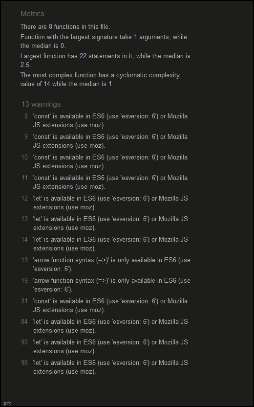

# Rock Paper Scissors
## A website to enable users to play a classic game of chance

My goal was to create a historical website to give some basic biograpical information, pictures, bibliography etc. of a writer and historical period in which I have an interest.

View the live project here : [rock-paper-scissors](https://conorjbr.github.io/rock-paper-scissors/)

## Contents

    1. User Experience (UX)
    2. General site design
    3. Responsivenes
    4. Features
    5. Testing
    6. Deployment
    7. Credits
    8. Conclusions

## User Experience (UX)
### Target audience

### First Time User

As a return user I will be using the contacts page and possibly the bibliography page also.
Site Aims

### General design of site

I did some preliminary rough wireframe sketches of the proposed site layout before commencing my html coding and this was a very useful exercise to do. I did not use any wireframe creation sofware as I felt that the site structure was simple and my basic sketches were sufficient. See sketches below.

#### Wireframe preliminary sketch 1

Home page -  small screen
#### Wireframe preliminary sketch 2

Game page - small screen
#### Wireframe preliminary sketch 3

Home page - large screen
#### Wireframe preliminary sketch 4

Game page - large screeen

## Responsiveness

I checked the URL in the "Am I Responsive" tool at Am I responsive,

See results below.

This checks the website responsiveness at the following screen sizes Desktop 1600x992px scaled down to scale(0.3181) Laptop 1280x802px scaled down to scale(0.277) Tablet 768x1024px scaled down to scale(0.219) Mobile 320x480px scaled down to scale(0.219)

Overall the responsiveness looked acceptable. I also checked all pages and manipulated screen size with the DevTools to check this and found results mostly acceptable.

Following further review & discussions with fellow students and my mentor. I realised that the responsiveness of my constacts page at 360px was in fact not acceptable and I modified styling of this page further to improve this. I mainly used dev tools to check resolution at the various sizes and once I got the hang of settting the screen width correctly I found this worked OK for me. I feel the responsiveness is acceptable at the various screen sizes.

## Features

### Home Page
#### Nav bar
I added a navigation bar using an unordered list to create two links as follows ;

    Home
    Game

#### Main header
#### Game instructions
#### How to win instructions
#### Scoring / Reset scores instrutions

### Game Page
#### Nav bar
I added a navigation bar using an unordered list to create two links as follows ;

    Home
    Game

#### Buttons for user to make choice
#### Display are for user choice, computer choice and gamre result
#### Scoreboard area with reset button

As noted above I felt that this was an aesthetically pleasing, artistic and interesting layout for the user to begin their interaction with the site.

I felt the site needed some aesthetic appeal. If time and ability allowed I would like to expand the styling of this page a lot further.

## Testing

### Validator Testing
HTML tested with W3C markup validation service
CSS tested with W3C CSS validation service

#### HTML

    A number of errors were found in the HTML code as noted below.

        
    These were addressed and corrected and the final outputs from validator are as follows

    Home page

    Game Page

    
    Style.css

    

    
    script.js

### Manual Testing

    Navigation Menu

        Verify that all the links link to the correct pages and there are no broken links,
            test result - pass

        Verify that hover effects work consistently on all links,
            test result - pass

    Home Page

        Verify that images are not pixellated and responsive at the required screen sizes,
            test result - pass

        Verify that all text is legible and divided into organised paragraphs
            test result - pass

        Verify that game page link is working and link to correct external site,
            test result - pass

    Game page
       Verify that game page link is working and link to correct external site,
            test result - pass
        
        Veriify that game choices operate correctly.
            test result - pass
        Verify that computer choices operate correctly.
            test result - pass
        Verify that reult calulation works and is diplayed correctly.
            test result - pass
        Verify that scoreboard increments "win, "lose" & "draw" as appropriate.
            test result - pass
        Verify that score rest button sets all scores back to 0.
       

  

Unfixed Bugs

    None

### Accessibility Testing
#### Lighthouse testing.

I ran each page of the site through the chrome lighthouse testing system. Results for overall site are as per below. 

### Deployment

The live link can be found here - 

The site was deployed to GitHub pages. The steps to deploy are as follows:

    In the GitHub repository, navigate to the Settings tab
    From the source section drop-down menu, select the Master Branch
    Once the master branch has been selected, the page will be automatically refreshed with a detailed ribbon display to indicate the successful deployment.

How to Fork a Repository

    In the GitHUb repository, click the "fork" tab at top right of page
    Check the fork name is correct
    Select an owner for the forked repository
    Edit the description if required
    Click on green "Create Fork" button at bottom of page

Hot to Clone a Repository

    Fork the repository using the steps above
    Above the file list, click Code (Usually green at the top right of the code window)
    Choose if you want to clone using HTTPS, SSH or GitHub CLI, then click the copy button to the right
    Open Git Bash
    Change the directory to where you want your clone to go (your own github)
    Type git clone and then paste the URL you copied in step 4
    Press Enter to create your clone

How to Make a Local Clone

    Under the repository name, above the list of files, click Code
    Here you will have two options, Clone or Download the repository
    Clone the repository using HTTPS, clicking on the icon to copy the link
    Launch the Gitpod workspace or choose your own directory
    Open Git Bash
    Change the current working directory to the new location of where you want the cloned directory.
    Type git clone and then paste the URL
    Press Enter, to create local clone to chosen directory

OR

    Download ZIP file
    Create a new repository using downloaded ZIP file.

### Credits

#### Content

    Images

    HTML

    CSS

    Javascript

    Help & Inspiration
    

    W3 schools
        Various tips and trick to get the css styling to work.

    Love Maths project
        SCore board increment functions

    coder coder !
        Organising divs and applying correct styling

    freecodecamp
        Grid styling 

    Stack overflow
        Misc tips and tricks with JS functoins.

    Mozilla MDN web docs
        Working with firefox Dev Tools

    Code Institute Mentor, Harry Dhillon @Harry-Leepz

    Code institute alumni and students (via Slack chat)

    Code Institute tutoring services

Project Conclusions

I found myself very confused at the start of this project as I did not have any previous experience of Javascript and found the lossons and challenges very difficult as I worked through them. I found that I learned a lot about this language very quickly while working through the various challenges to get the project completed. I have definitely learned a lot about Javascrpt and about how to approach putting together a coding project. I am now keen to put this knowledge to further use.

Learnings from this project

I have learned to apply the basics of Jvascript to manipulate the DOM.  I have also learned to use html and css styling with more fluency than in the first project.  This has been more difficult than I thought it would be, particularly the JS. 

Things I would do differently if starting again

Future improvements to the site

Acknowledgements & thanks

Thanks to the tutors at code institute and my mentor Harry Dhillon for their help with getting this project over the line. Also thanks to my fellow code institute students and alumni who assisted me so much via slack messages and calls. I had not realised there was such a great community of coders out there. You are all a truly great bunch of people and I hope I can be helpful to other students in the same way in the future.

Note : This project was made purely for educational purposes and not for any financial gain.

BACK TO TOP