# Rock Paper Scissors
## A website to enable users to play a classic game of chance

My goal was to create a simple game website to enable users to play the classic game of chance, Rock-Paper-Scissors.. I chose this game because it has a simple format and the Javascript functionality seemed to be within my skill level to achieve.  I had originally selected another game called "Mancala" to use for my project but, after discussions with my mentor, it was clear that this would be beyond my current capabilities.

View the live project here : [rock-paper-scissors](https://conorjbr.github.io/rock-paper-scissors/)

## Contents

    1. User Experience (UX)
    2. General site design
    3. Responsivenes
    4. Features
    5. Testing
    6. Deployment
    7. Credits
    8. Conclusions

## User Experience (UX)

I decided that the game should consist of two main pages, one instructions page and one game page.
I also wanted the game to keep score of the win, lose and draws and to have a reset button to set the scores back to zero when required.

The styling I chose was a simple layout with a number of images to illustrate the game to the left and right of the screen.  
I styled the buttons with both icons and word descriptions.
I picked a colour scheme with fairly high contrast and which I felt was reasonably visually pleasing.

### Target audience
My target audience is anyone who has played this game in the real world and wants to have a bit of fun playing it online.  The game can also be used by kids (& adults!) to make a decision on an impartial basis on such important issues as "who goes first?" , "who gets the last piece of cake?"  etc. etc. 

### First Time User
I wanted the first time user to intuitively grasp the principles of the game and to be able to play the game, keep the scores and reset the scores with minimal instructions.

As a return user I will be using the scoreboard and scoreboard reset functions.

### General design of site

I did some preliminary rough wireframe sketches of the proposed site layout before commencing my html coding and this was a very useful exercise to do. I did not use any wireframe creation software as I felt that the site structure was simple and my basic sketches were sufficient. 

See my wireframe sketches below.

#### Wireframe preliminary sketch 1
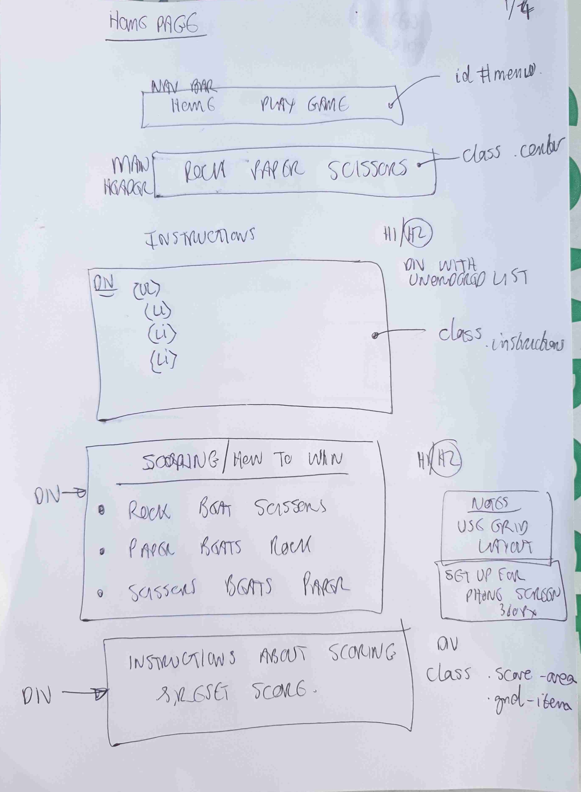
Home page -  small screen

#### Wireframe preliminary sketch 2
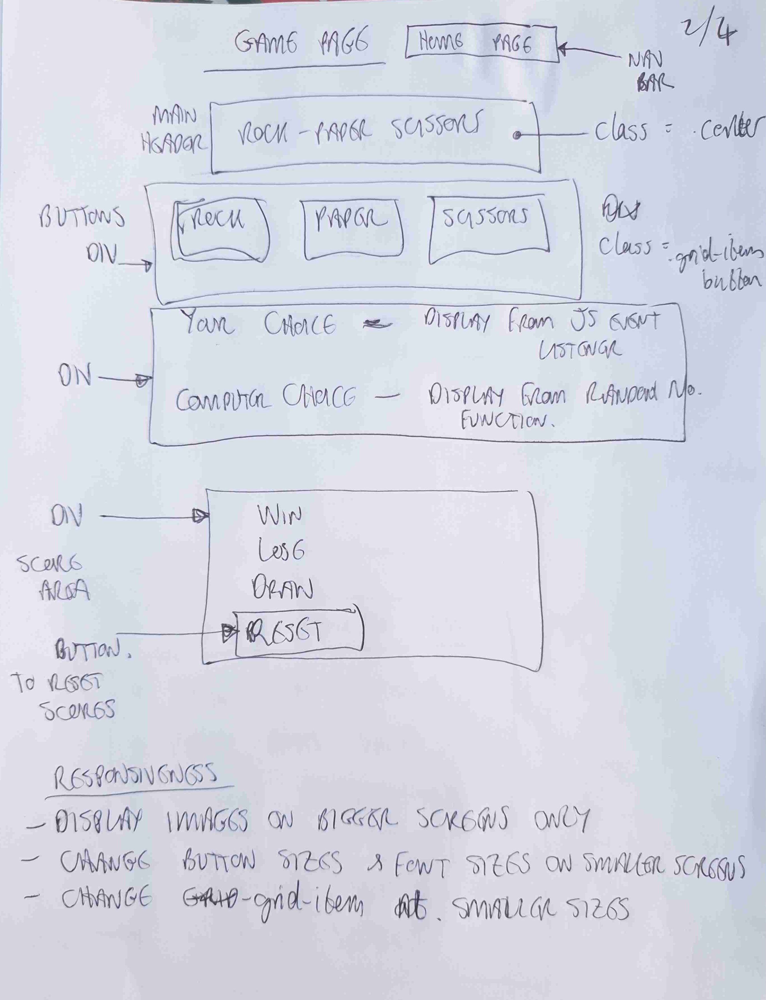
Game page - small screen

#### Wireframe preliminary sketch 3
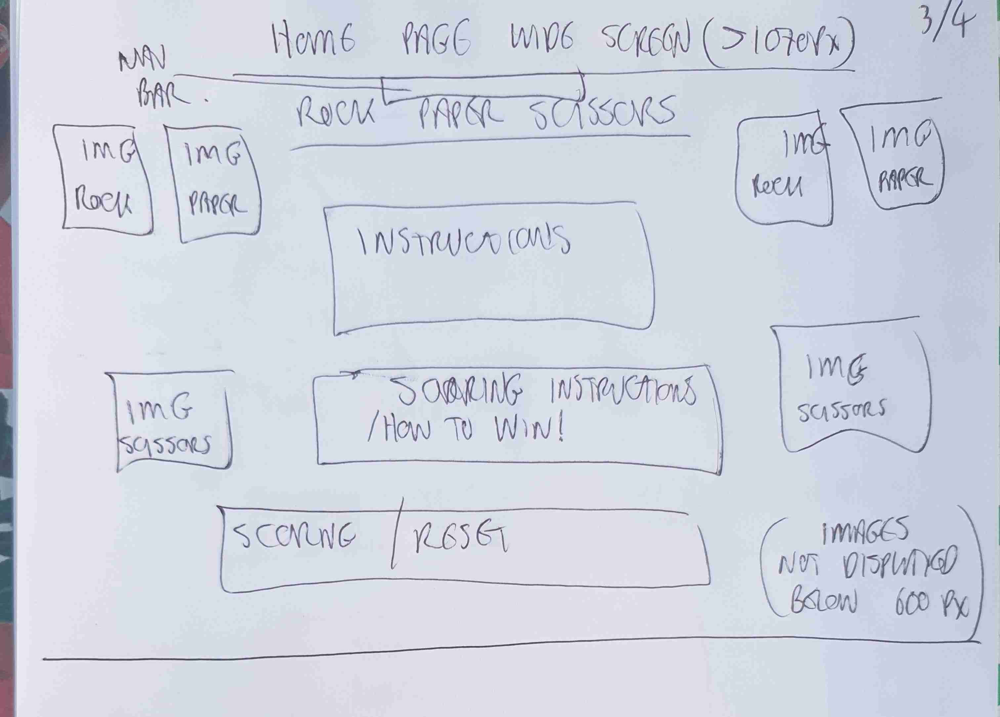
Home page - large screen

#### Wireframe preliminary sketch 4
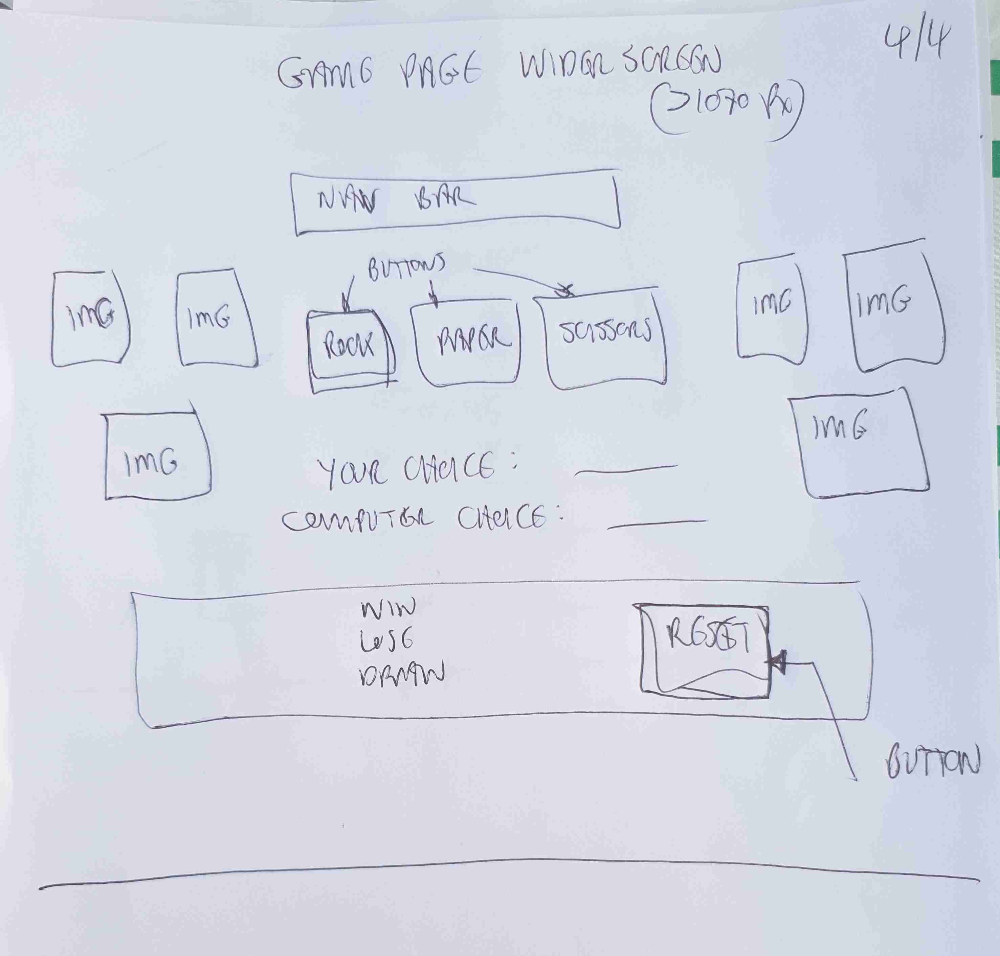
Game page - large screeen

I used a basic style layout to make a visually attractive and easily navigable site.
I added a nav bar to enable easy navigation from the home (instructions) page to the game page and back again.  I did not add a clickable page header as I felt that this ws not necessary for the effective operation of the site,

## Responsiveness

I checked the URL in the "Am I Responsive" tool at https://ui.dev/amiresponsive,

See results below.
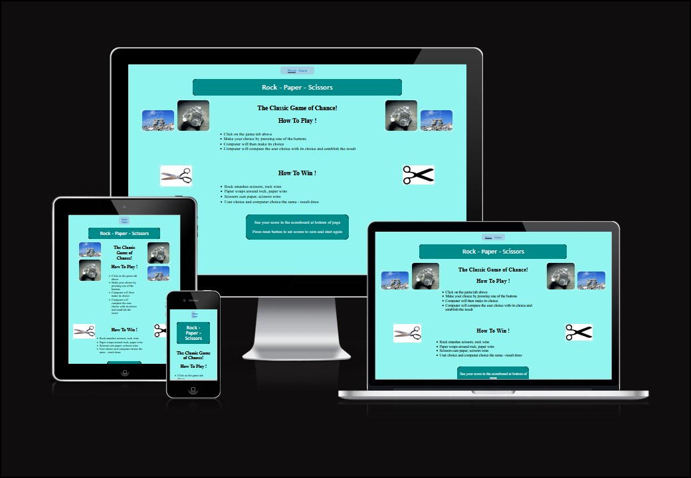

This checks the website responsiveness at the following screen sizes Desktop 1600x992px scaled down to scale(0.3181) Laptop 1280x802px scaled down to scale(0.277) Tablet 768x1024px scaled down to scale(0.219) Mobile 320x480px scaled down to scale(0.219)

Overall the responsiveness looked acceptable. I also checked all pages and manipulated screen size with the DevTools to check this and found results acceptable.

Following peer review of my completed code with fellow students and my mentor. I realised that the responsiveness of my game page at 360px was in fact not acceptable and I modified styling of this page further to improve this and to ensure that scores area visible while playing the game on a small screen.  I feel the responsiveness was then acceptable at the various screen sizes.

## Features

### Home Page

I used a basic grid layout and felt that this was an aesthetically pleasing, artistic and interesting layout for the user to begin their interaction with the site.

#### Nav bar
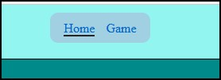
I added a navigation bar using an unordered list to create the links as above.

#### Main header
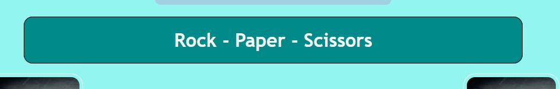

#### Game instructions
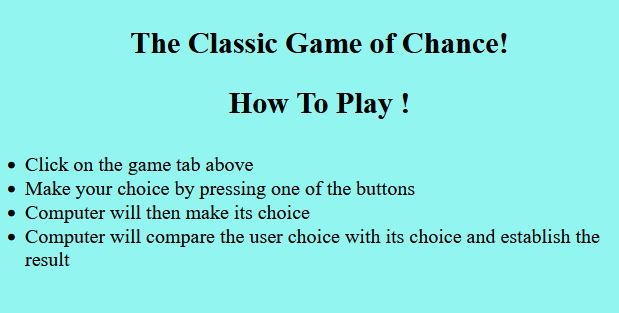

#### How to win instructions
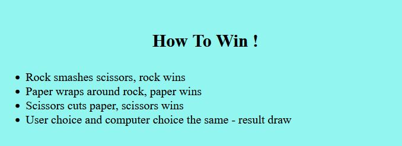

#### Scoring / Reset scores instructions
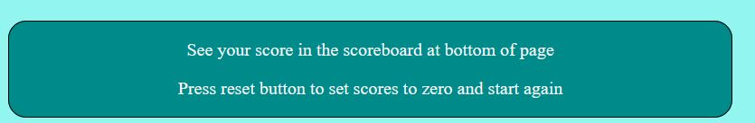

### Game Page

#### Nav bar
Added as per home page.

#### Buttons for user to make choice
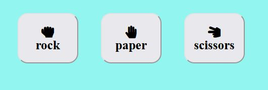

#### Display area for user choice, computer choice and game result
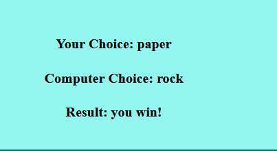

#### Scoreboard area with reset button
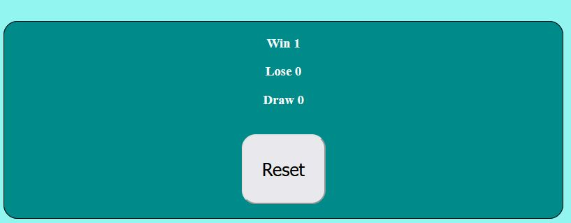

I would also have liked to add a further level to the game with 5 options  (ie Rock, Paper, Scissors, Lizard, Spock) and to have the game automatically move to the higher level when a certain score was reached.  I struggled with the functions to achieve the auto level change so I decided to put this on my list of future improvements.

## Testing

### Validator Testing

#### HTML
HTML code was tested with W3C markup validation service, results as follows

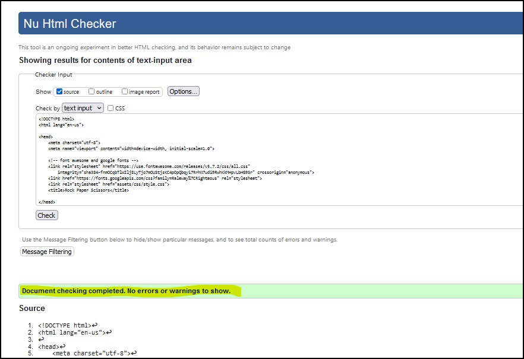
Home page

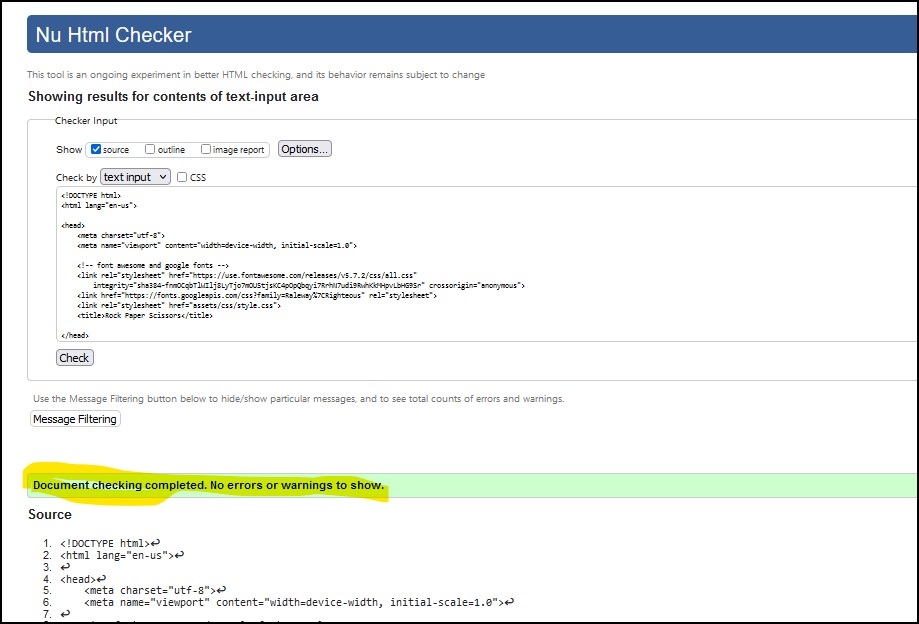
Game page

#### CSS
CSS code was tested with W3C CSS validation service, results as follows
       
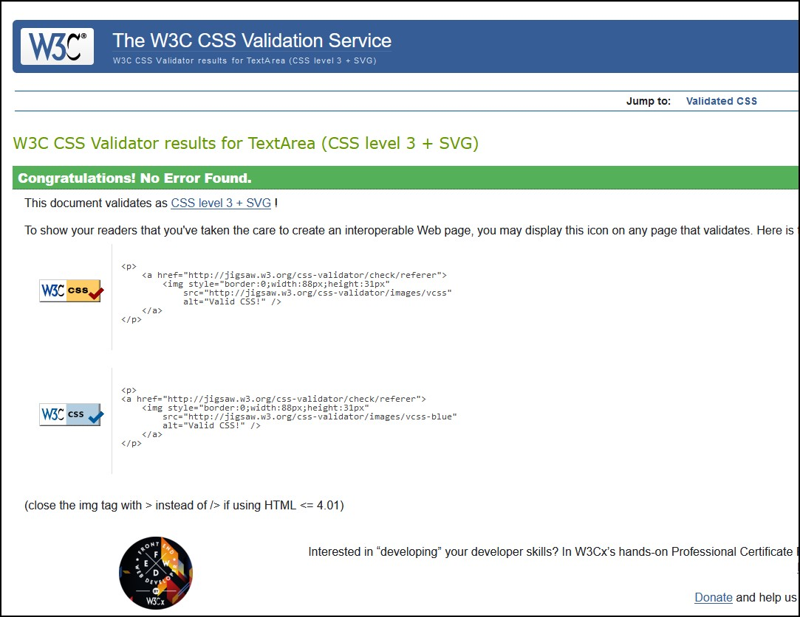
 Style.css
    
#### Javascript
JS code was tested with JShint Javascript cose quality tool.
13 errors were shown in the test result as follows

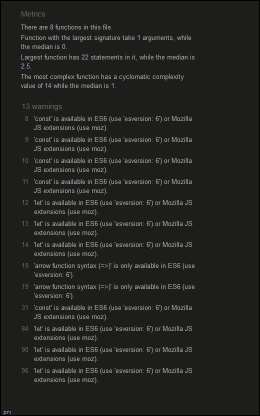
Script.js - first test results

I was not sure what these errors meant so I did some internet searching and found a page on stack overflow that advised taking the following action to eliminate these errors.

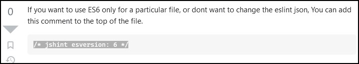

I pasted in this commment to the top of my js file and the errors were removed, see revised report below

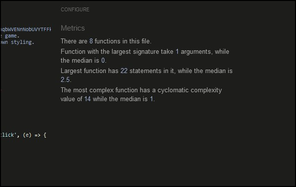
Script.js - second test results

### Manual Testing

##### Navigation Menu

        Verify that all the links link to the correct pages and there are no broken links,
            test result - pass
        Verify that hover effects work consistently on all links,
            test result - pass

##### Home Page

        Verify that images are not pixellated and responsive at the required screen sizes,
            test result - pass
        Verify that all text is legible and divided into organised paragraphs
            test result - pass
        Verify that game page link is working and link to correct external site,
            test result - pass

##### Game page
       Verify that game page link is working and link to correct external site,
            test result - pass
        Verify that game choices operate correctly.
            test result - pass
        Verify that computer choices operate correctly.
            test result - pass
        Verify that reult calulation works and is diplayed correctly.
            test result - pass
        Verify that scoreboard increments "win, "lose" & "draw" as appropriate.
            test result - pass
        Verify that score rest button sets all scores back to 0.
            test result - pass
       
Unfixed Bugs

    None

### Accessibility Testing
#### Lighthouse testing.

I ran each page of the site through the chrome lighthouse testing system. Results for overall site are as per below. 
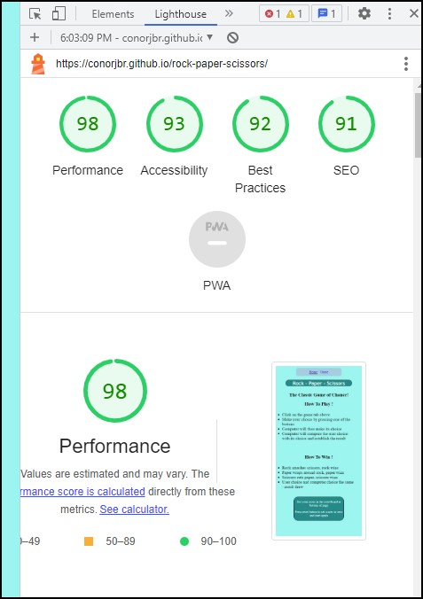

These ratings looked acceptable.

### Deployment

The live link can be found here - https://conorjbr.github.io/rock-paper-scissors/

The site was deployed to GitHub pages. The steps to deploy are as follows:

    In the GitHub repository, navigate to the Settings tab
    From the source section drop-down menu, select the Master Branch
    Once the master branch has been selected, the page will be automatically refreshed with a detailed ribbon display to indicate the successful deployment.

How to Fork a Repository

    In the GitHUb repository, click the "fork" tab at top right of page
    Check the fork name is correct
    Select an owner for the forked repository
    Edit the description if required
    Click on green "Create Fork" button at bottom of page

How to Clone a Repository

    Fork the repository using the steps above
    Above the file list, click Code (Usually green at the top right of the code window)
    Choose if you want to clone using HTTPS, SSH or GitHub CLI, then click the copy button to the right
    Open Git Bash
    Change the directory to where you want your clone to go (your own github)
    Type git clone and then paste the URL you copied in step 4
    Press Enter to create your clone

How to Make a Local Clone

    Under the repository name, above the list of files, click Code
    Here you will have two options, Clone or Download the repository
    Clone the repository using HTTPS, clicking on the icon to copy the link
    Launch the Gitpod workspace or choose your own directory
    Open Git Bash
    Change the current working directory to the new location of where you want the cloned directory.
    Type git clone and then paste the URL
    Press Enter, to create local clone to chosen directory

OR

    Download ZIP file
    Create a new repository using downloaded ZIP file.

### Credits

#### Content

##### Images
    1. freeimages.com
    2. google image search

##### HTML

    1. W3schools
    2. My previous project (Oliver St. John Gogarty)  - Nav bar

##### CSS
    1. W3 schools
    2. CI Love maths project
    3. My previous project (Oliver St. John Gogarty)  - Nav bar

##### Javascript
    1. Youtube tutorial at : https://www.youtube.com/watch?v=ec8vSKJuZTk
    This was used to create the basic functions for the game which I modified and added to.

    2. Love Maths run through project - ideas for creating the score boards.

##### Help & Inspiration
    1. W3 schools
    Various tips and trick to get the css styling to work.

    2. Love Maths project
    Score board increment functions

    3. coder coder !
    Organising divs and applying correct styling

    4. freecodecamp.org
    Grid styling 

    5. Stack overflow
    Misc tips and tricks with JS functoins.

    6. Mozilla MDN web docs
    Working with firefox Dev Tools

    7. Code Institute Mentor, Harry Dhillon @Harry-Leepz

    8. Code institute alumni and students (via Slack chat)

    9. Code Institute tutoring services

### Project Conclusions

I found myself very confused at the start of this project as I did not have any previous experience of Javascript and found the course lessons and challenges very difficult as I worked through them. I found that I learned a lot about this language very quickly while working through the various challenges to get the project completed. I have definitely learned a lot about Javascript and about how to approach putting together a coding project. I am now keen to put this knowledge to further use.

Learnings from this project

I have learned to apply the basics of Javascript to manipulate the DOM.  I have also learned to use html and css styling with more fluency than in my first project.  This project has been more difficult than I thought it would be, particularly the JS. 

Things I would do differently if starting again

I would watch more Youtube videos and JS guides and tutorials outside of the course.
I would not get so stuck on completing all of the lesson challenges as these took a long time and I don't think I learned a lot from them in to get this project completed.  I plan to go through the lessons again now using the experience with JS that I have gained from the project.

#### Future improvements to the site

I would like to add the extrac game levels and enable automatic change of game level when a certain number of "wins" is scored.  I would also like to experiment further with more sophisticated styling of the game elements.

#### Acknowledgements & thanks

Thanks to the tutors at code institute and my mentor Harry Dhillon for their help with getting this project over the line. Also thanks to my fellow code institute students and alumni who assisted me so much via slack messages and calls. I had not realised there was such a great community of coders out there. You are all a truly great bunch of people and I hope I can be helpful to other students in the same way in the future.

Note : This project was made purely for educational purposes and not for any financial gain.

[BACK TO TOP](# Rock Paper Scissors)